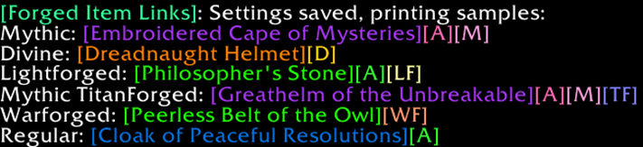

# ForgedItemLinks

**ForgedItemLinks** is a lightweight Synastria addon that allows you to **add coloured [Tags] to linked forged and Mythic items in chat.**

---

## 🔧 Features

- Automatically adds customizable tags to linked forged, Mythic, and Divine items in chat.
- Settings menu to change the text and position of the tags.
- Adds a pink [A] for attunable items, and a green [A] for attuned items.

---

## 📦 Installation

1. Download or clone this repository.
2. Move the `ForgedItemLinks` folder into your WoW AddOns directory:

   ```
   Synasatria/Interface/AddOns/
   ```

3. Restart the game or run `/reload`.

---

## 💬 Slash Commands

| Command | Description |
|---------|-------------|
| `/fil` | Opens the settings UI. |

---

## 📸 Screenshots

| Settings Panel | In-game Examples |
|----------------|----------------|
|  |     |

 

---


## 📜 License

GPL-3.0 license

---
